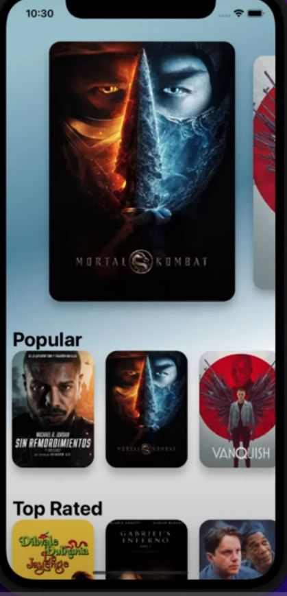

# Movies App

## Overview
This React Native application provides users with details about movies using The Movie Database (TMDB) API. It features a home screen with a carousel displaying currently playing movies and horizontal sliders for different categories such as popular, upcoming, and top-rated movies. Users can navigate to a detailed screen that displays more information about a selected movie.

## Introduction

The "Movies App" allows users to do the following:

1. View popular, now playing, upcoming and top rated movies.
2. View Individual movies and get the movie data such as cast, movie duration, summary, recommended movies,etc.
3. Search for Movies and People.



## Features
- Display movies in different categories (Now Playing, Popular, Upcoming, Top Rated)
- View movie details including title, original title, and additional information
- Smooth navigation between Home and Detail screens
- Uses `react-native-snap-carousel` for an interactive movie browsing experience
- Implements a gradient background that adapts to the dominant colors of the selected movie poster

## Screens
### HomeScreen
- Displays a carousel of now-playing movies
- Lists additional categories with horizontally scrolling movie posters
- Uses dynamic colors extracted from movie posters for background gradients

### DetailScreen
- Shows an enlarged movie poster
- Displays detailed movie information
- Provides a back button for navigation

## Installation
### Prerequisites
Ensure you have the following installed:
- Node.js
- React Native CLI or Expo CLI
- Android Studio/Xcode for emulator or a physical device

### Steps
1. Clone the repository:
   ```sh
   git clone https://github.com/your-repo/movie-app.git
   cd movie-app
   ```
2. Install dependencies:
   ```sh
   npm install
   ```
3. Run the application:
   ```sh
   npx react-native run-android   # For Android
   npx react-native run-ios       # For iOS
   ```

## Dependencies
- `react-navigation` for screen navigation
- `react-native-snap-carousel` for smooth movie browsing
- `react-native-vector-icons` for icons
- `react-native-safe-area-context` for proper layout adjustments

## Folder Structure
```
/movie-app
├── src
│   ├── components
│   │   ├── MovieDetails.tsx
│   │   ├── MoviePoster.tsx
│   │   ├── HorizontalSlider.tsx
│   ├── hooks
│   │   ├── useMovies.ts
│   │   ├── useMovieDetails.ts
│   ├── screens
│   │   ├── HomeScreen.tsx
│   │   ├── DetailScreen.tsx
│   ├── navigation
│   │   ├── Navigation.tsx
│   ├── context
│   │   ├── GradientContext.tsx
│   ├── helpers
│   │   ├── getColors.ts
```

## API Integration
This app fetches movie data from TMDB. To use the API, get an API key from [TMDB](https://www.themoviedb.org/) and store it securely in your environment variables.

## Contributing
1. Fork the repository
2. Create a feature branch (`git checkout -b feature-branch`)
3. Commit your changes (`git commit -m 'Add new feature'`)
4. Push to the branch (`git push origin feature-branch`)
5. Create a Pull Request

## License
This project is open-source and available under the [MIT License](LICENSE).
